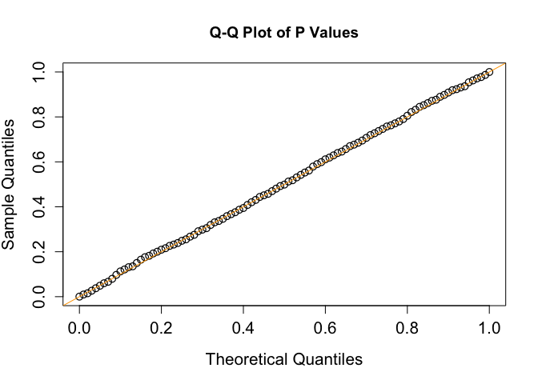
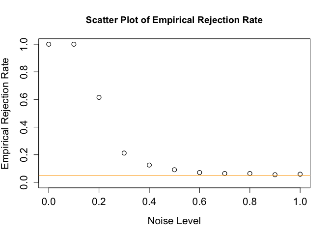

<!-- README.md is generated from README.Rmd. Please edit that file -->

# SIT

<!-- badges: start -->
<!-- badges: end -->

The goal of SIT is to conduct independence test and computes the sit
coefficient between two vectors x and y, possibly all paired
coefficients for a matrix. The reference for the methods implemented
here is Zhang, Yilin, Canyi Chen, and Liping Zhu. 2022. “Sliced
Independence Test.” Statistica Sinica. <doi:10.5705/ss.202021.0203>.
This package incorporates the Galton peas example.

## Installation

You can install the R CRAN version with

``` r
install.packages("SIT")
```

and the development version of SIT from [GitHub](https://github.com/)
with:

``` r
# install.packages("devtools")
devtools::install_github("canyi-chen/SIT")
```

## Example

This is a basic example which shows you how to solve a common problem:

### Null hypothesis: independence

``` r
library(SIT)
## basic example code
set.seed(47)
n <- 1000
X <- rnorm(n)
Y <- rnorm(n)
sitcor(X, Y, pvalue = TRUE)
#> $sitcor
#> [1] -0.0235964
#> 
#> $sd
#> [1] 0.02828427
#> 
#> $pval
#> [1] 0.7979324
```

### Alternative hypothesis: dependence

``` r
library(SIT)
## basic example code
set.seed(47)
n <- 1000
X <- rnorm(n)
Y <- sin(X) + rnorm(n)
sitcor(X, Y, pvalue = TRUE)
#> $sitcor
#> [1] 0.1832687
#> 
#> $sd
#> [1] 0.02828427
#> 
#> $pval
#> [1] 4.600498e-11
```

### Distribution of the p value under the null

``` r
library(SIT)
set.seed(47)
simulation <- function(n = 1000) {
  X <- rnorm(n)
  Y <- rnorm(n)
  return(sitcor(X, Y, pvalue = TRUE))
}
out <- replicate(1000, simulation())

plot(
  seq(0, 1, 0.01),
  quantile(unlist(out[3, ]), probs = seq(0, 1, 0.01)),
  pch = 1,
  cex = 1.2,
  cex.lab = 1.3,
  cex.axis = 1.3,
  ylab = "Sample Quantiles",
  xlab = "Theoretical Quantiles",
  type = "p",
  xlim = c(0, 1),
  ylim = c(0, 1),
  lwd = 1.2,
  main = "Q-Q Plot of P Values"
)
abline(0, 1, col = "orange")
```



### Empirical rejection rate

``` r
library(SIT)
library(future.apply)
plan(multisession, workers = 11)

set.seed(47)
simulation <- function(alpha = 0.05, sigma_arr = NULL, n = 1000) {
  if(is.null(sigma_arr)) {
    sigma_min <- 0
    sigma_max <- 1
    sigma_arr <- seq(sigma_min, sigma_max, length.ou = 11)
  }
  out <- rep(NA, length(sigma_arr))
  for(isigma_arr in seq_along(sigma_arr)) {
    sigma <- sigma_arr[isigma_arr]
    X <- rnorm(n)
    Y <- sin(X) + sigma*rnorm(n)*10
    out[isigma_arr] <- sitcor(X, Y, pvalue = TRUE)$pval
  }
 
  return(out<alpha)
}
sigma_min <- 0
sigma_max <- 1
sigma_arr <- seq(sigma_min, sigma_max, length.ou = 11)
alpha <- 0.05
out <- future_replicate(1000, simulation(alpha = alpha, sigma_arr))

plot(
  sigma_arr,
  rowMeans(out),
  pch = 1,
  cex = 1.2,
  cex.lab = 1.3,
  cex.axis = 1.3,
  xlab = "Noise Level",
  ylab = "Empirical Rejection Rate",
  type = "p",
  xlim = c(0, 1),
  ylim = c(0, 1),
  lwd = 1.2,
  main = "Scatter Plot of Empirical Rejection Rate"
)
abline(h = alpha, col = "orange")
```


